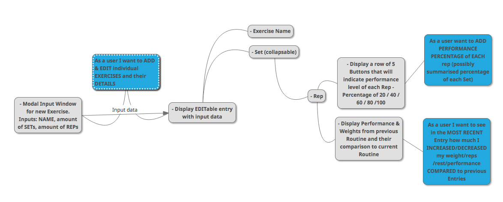
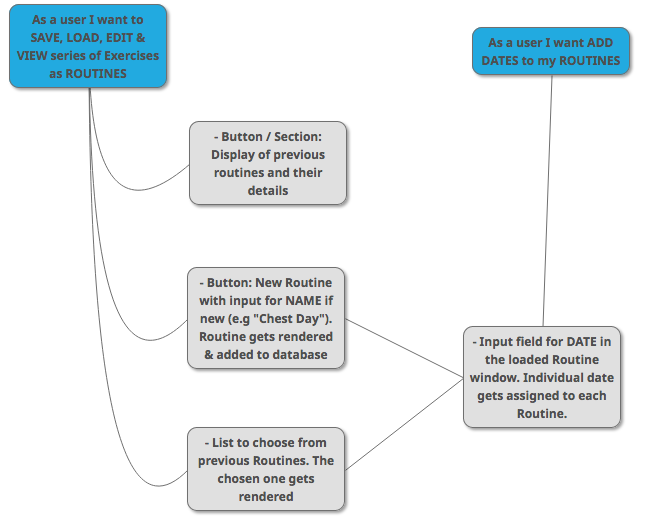
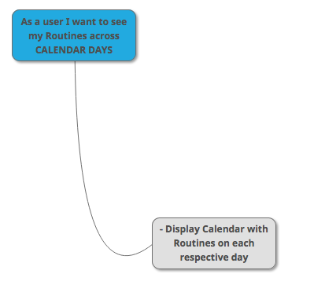

# Precision Gym App

[https://precision-gym.netlify.app/](https://precision-gym.netlify.app/)

## About the app

The purpose of this app is track the progress of a user's performance in the gym. The user would be able to manually add/edit their exercises and input statistics specific for each exercise. Added exercises could then be save in routines. The routines would be displayed in the UI.

### Personal note

As a gym-goer I'm interested in the progress of my performance. To do that I make notes tracking the amount of sets and repetitions (reps) in each exercise. Often towards the end of an exercise rep performance may slip as the muscles get fatigued. So I thought it would be a good idea to also track the **performance of each individal rep**. However, that would take too many notes, so it makes sense to have that in an app.

## Status

### Authentication:

- [x] Basic sign in and log in options with name, email and password
- [x] Option to explore the app's feature as a guest.

### User Dashboard features:

- [x] Adding routines which would store exercises.
- [x] Assigning dates to each performed routine.
- [x] Adding the current date to a routine
- [x] Adding and deleting exercises
- [x] Modifying the name of each exercise
- [x] Adding and removing sets
- [x] Modifying the used weight in each set
- [x] Adding and removing reps in each set
- [x] Modifying the performance of each rep on a 1-5 scale

### Database:

- [x] Fetching the user's stored data upon loggin in
- [x] Updating the online database whenever user provides or modifies data

### UI:

- [x] Information hierarchy of input data
- [x] Basic CSS styling of components
- [ ] Responsive Web Design
- [ ] Implemented guidelines of app's features
- [ ] Accessibility

## Technologies used

- ReactJS Framework
- Functional Components
- CSS for each individual Component
- Realtime Database at Firebase.com
- Firebase Authntication tools

## User Stories & Features

