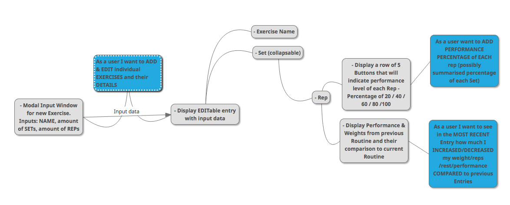
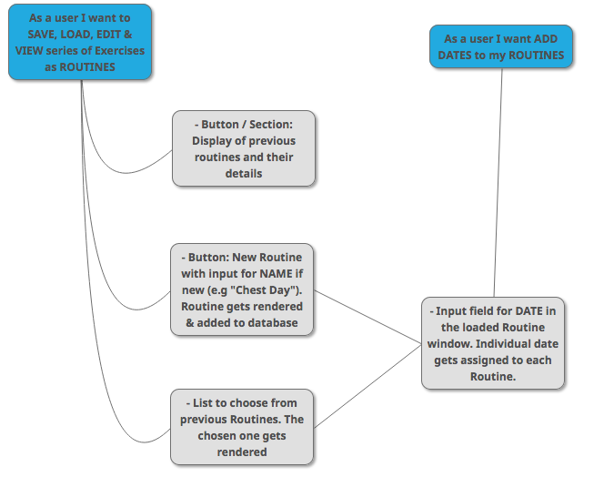
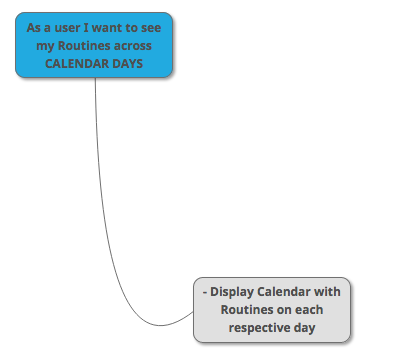

# Precision Gym App

## About the app

The purpose of this app is track the progress of a user's performance in the gym. The user would be able to manually add and edit their exercise routines. The routines with their input data would be later displayed in the UI.

## Status

In development...

## App preview

[https://precision-gym.netlify.app/](https://precision-gym.netlify.app/)

## Technologies used

- ReactJS Framework
- Functional Components
- CSS for each individual Component
- Realtime Database at Firebase.com

## User Stories & Features

