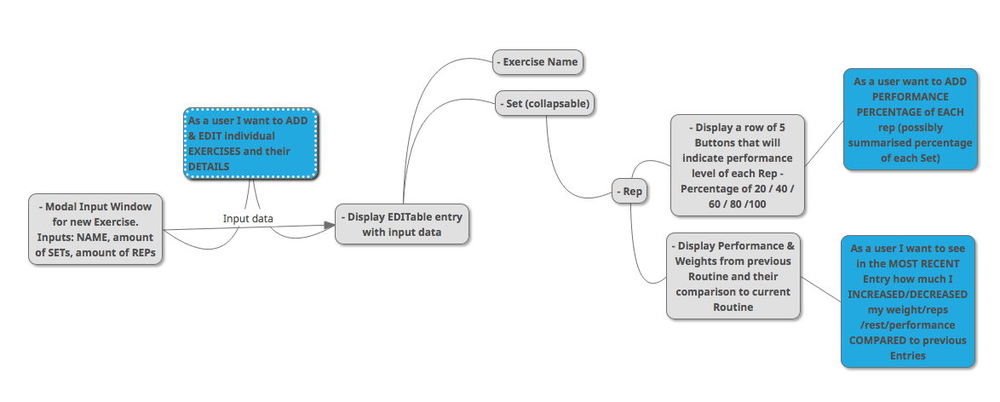
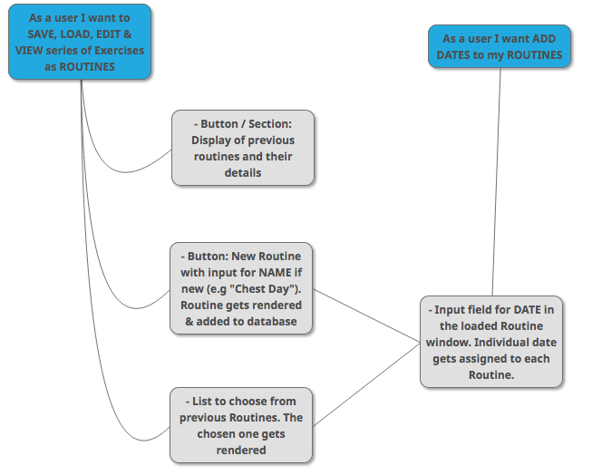
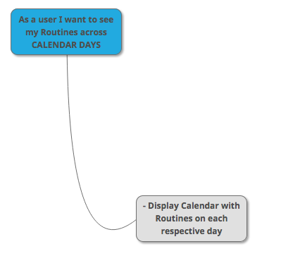

# Precision Gym App

[https://precision-gym.netlify.app/](https://precision-gym.netlify.app/)

## About the app

The purpose of this app is track the progress of a user's performance in the gym. The user would be able to manually add/edit their exercises and input statistics specific for each exercise. Added exercises could then be save in routines. The routines would be displayed in the UI.

### Personal note

As a gym-goer I'm interested in the progress of my performance. To do that I make notes tracking the amount of sets and repetitions (reps) in each exercise. Often towards the end of an exercise rep performance may slip as the muscles get fatigued. So I thought it would be a good idea to also track the **performance of each individal rep**. However, that would take too many notes, so it makes sense to have that in an app.

## Setup & Installation

1. Clone the repository
2. Install dependencies:
   ```bash
   npm install
   ```
3. Create a `.env` file in the project root with your Firebase credentials:
   ```
   VITE_API_KEY=your_api_key
   VITE_AUTH_DOMAIN=your_auth_domain
   VITE_DATABASE_URL=your_database_url
   VITE_PROJECT_ID=your_project_id
   VITE_STORAGE_BUCKET=your_storage_bucket
   VITE_MESSAGING_SENDER_ID=your_messaging_sender_id
   VITE_APP_ID=your_app_id
   ```
4. Run the development server:
   ```bash
   npm run dev
   ```

## Firebase Configuration

This app uses Firebase for backend services:

- **Authentication**: User sign-up, sign-in, and guest access
- **Realtime Database**: Storing user routines, exercises, and workout data

### Security Rules

Firebase security rules are implemented to protect user data:
- ✅ Users can only access their own data (`/users/{uid}/`)
- ✅ All database operations require authentication
- ✅ Data structure validation ensures data integrity
- ✅ Guest users have special shared access to `/users/guest/`. 
All new data is deleted after the user logs out of the guest account.

For detailed security rules deployment instructions, see [FIREBASE_SECURITY_DEPLOYMENT.md](./FIREBASE_SECURITY_DEPLOYMENT.md)

### Database Structure

```
users/
  {userId}/
    routines/
      {routineName}/
        routineName: string (required)
        routineId: number (optional)
        logbook/
          {date}/           # YYYY-MM-DD format
            [exerciseIndex]/
              id: number (required)
              name: string (required)
              sets/
                [setIndex]/
                  weight: number (required)
                  reps: array (required)
```

## Status

### Authentication:

- [x] Basic sign in and log in options with name, email and password
- [x] Option to explore the app's feature as a guest.

### User Dashboard features:

- [x] Adding routines which would store exercises.
- [x] Assigning dates to each performed routine.
- [x] Adding the current date to a routine
- [x] Adding and deleting exercises
- [x] Modifying the name of each exercise
- [x] Adding and removing sets
- [x] Modifying the used weight in each set
- [x] Adding and removing reps in each set
- [x] Modifying the performance of each rep on a 1-5 scale

### Database:

- [x] Fetching the user's stored data upon loggin in
- [x] Updating the online database whenever user provides or modifies data

### Security:

- [x] Firebase security rules implementation
- [x] User data isolation (users can only access their own data)
- [x] Authentication required for all database operations
- [x] Data structure validation (required fields, type checking)
- [x] Guest user special handling

### UI:

- [x] Information hierarchy of input data
- [x] Basic CSS styling of components
- [ ] Responsive Web Design
- [ ] Implemented guidelines of app's features
- [ ] Accessibility

## Technologies used

- **Frontend**: React 19, TypeScript
- **Build Tool**: Vite
- **Styling**: Component-scoped CSS
- **Backend**: Firebase Realtime Database
- **Authentication**: Firebase Authentication
- **Security**: Firebase Security Rules (see [database.rules.json](./database.rules.json))
- **Deployment**: Netlify

## Security & Privacy

- All user data is isolated and protected by Firebase security rules
- Authentication required for all database operations
- Users can only access their own data at `/users/{uid}/`
- Guest accounts use a shared data space (`/users/guest/`) that is cleared on sign-out
- Environment variables keep Firebase credentials secure
- Data structure validation prevents malformed or malicious data
- See [FIREBASE_SECURITY_DEPLOYMENT.md](./FIREBASE_SECURITY_DEPLOYMENT.md) for implementation details

## Deployment

### Application Deployment
The app is deployed on Netlify: [https://precision-gym.netlify.app/](https://precision-gym.netlify.app/)

### Firebase Security Rules Deployment
Security rules must be deployed separately to Firebase Console.

See [FIREBASE_SECURITY_DEPLOYMENT.md](./FIREBASE_SECURITY_DEPLOYMENT.md) for complete step-by-step instructions on:
- Deploying rules via Firebase Console
- Testing rules with Firebase Rules Playground
- Verifying security implementation
- Troubleshooting common issues

## User Stories & Features




